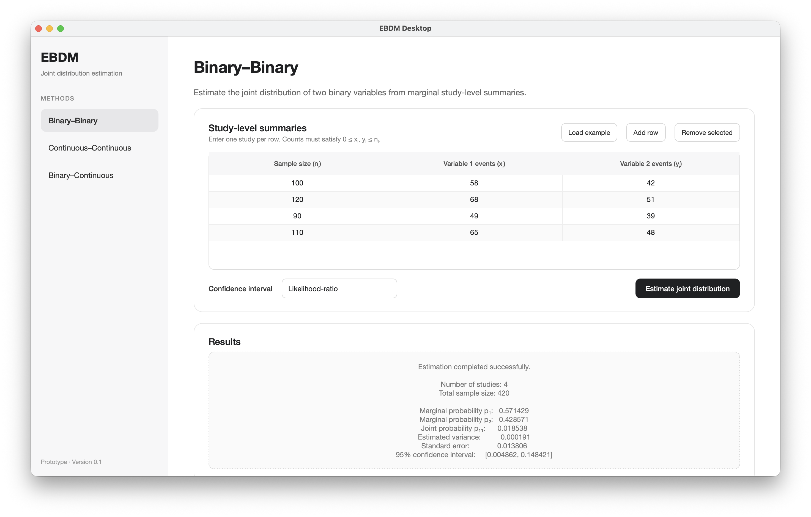
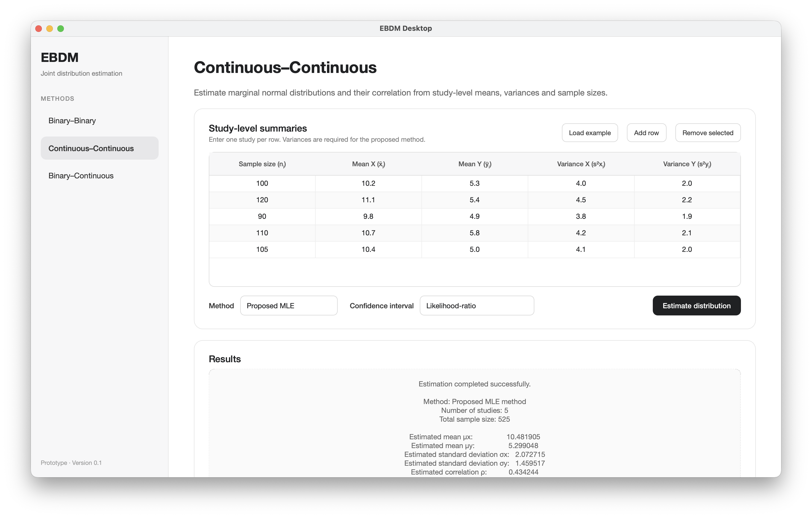
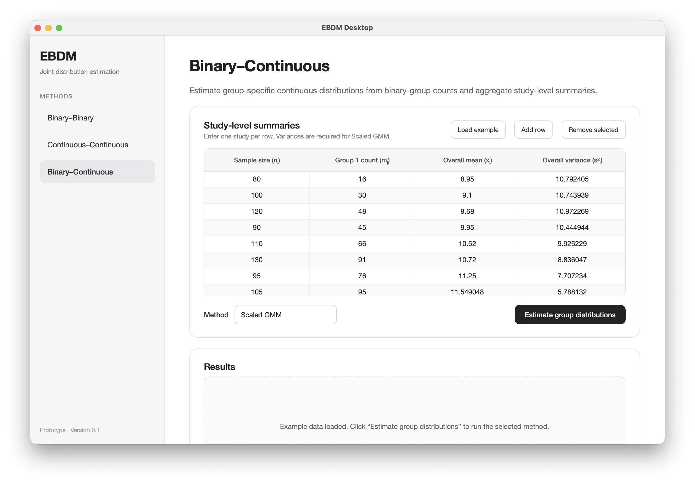

# EBDM Desktop

A lightweight macOS desktop prototype for estimating joint distributions from study-level marginal summaries.

The application translates methods from the EBDM research project into a standalone Python/Qt interface. R is not required at runtime.

## Download

[**Download EBDM Desktop for macOS — Apple Silicon**](https://github.com/LongwenShang/EBDM-desktop/releases/latest/download/EBDM-Desktop-macOS-arm64.dmg)

## Screenshots

### Binary–Binary



### Continuous–Continuous



### Binary–Continuous



## Current modules

### Binary–Binary

- Estimates marginal probabilities `p1` and `p2`
- Estimates the joint probability `p11`
- Reports variance, standard error, and normal or likelihood-ratio confidence intervals

### Continuous–Continuous

- Proposed maximum-likelihood estimator
- Weighted study-mean baseline
- Reports marginal means, marginal standard deviations, correlation, standard error, and confidence interval

### Binary–Continuous

- Scaled generalized method of moments estimator
- Naive likelihood estimator
- Reports group-specific means and standard deviations, standard errors, confidence intervals, convergence status, and objective value

## Interface

- Editable study-level summary tables
- Built-in example datasets
- Row addition and removal
- Input validation and error messages
- Scrollable layouts for smaller windows
- Warning for potentially unstable boundary estimates

## Technology

- Python 3.11
- PySide6 / Qt
- NumPy
- SciPy
- pandas
- PyInstaller

The statistical methods were originally developed in R and independently implemented in Python for this desktop prototype.

## Run from source

```bash
python3 -m venv .venv
source .venv/bin/activate
python -m pip install -r requirements.txt
python main.py
```

## Project structure

```text
ebdm-desktop/
├── ebdm_app/
│   ├── estimators/
│   │   ├── binary_binary.py
│   │   ├── continuous_continuous.py
│   │   └── binary_continuous.py
│   ├── binary_binary_page.py
│   ├── continuous_continuous_page.py
│   ├── binary_continuous_page.py
│   └── main_window.py
├── assets/
│   └── screenshots/
├── main.py
├── requirements.txt
└── README.md
```

## Development status

This is a functional research-software prototype rather than a production release.

Planned extensions include CSV/Excel import, result export, automated reports, additional diagnostics, Windows packaging, and macOS code signing and notarization.

## Background

EBDM reconstructs joint distributions from marginal summary statistics when individual-level data are unavailable. Potential applications include clinical-trial simulation, feasibility evaluation, and secondary analysis under data-access or privacy constraints.
